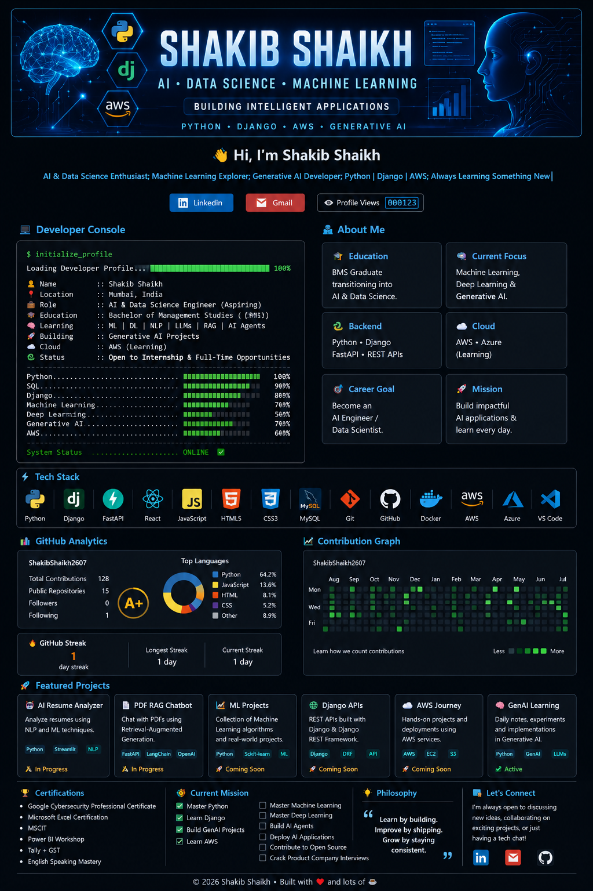

<h1 align="center">
  Hi 👋, I'm <span style="color:#4FC3F7;">Shakib Shaikh</span>
</h1>

<h3 align="center">
AI • Data Science • Machine Learning • GenAI • AWS
</h3>

<p align="center">
Building intelligent applications using Python, Machine Learning, Deep Learning and Generative AI.
</p>

<p align="center">

</p>

<p align="center">

</p>

## 👨‍💻 About Me

- 🎓 BMS Graduate transitioning into AI & Data Science
- 🤖 Currently learning Machine Learning, Deep Learning, NLP, LLMs and RAG
- ☁️ Exploring AWS Cloud & AI Deployment
- 🐍 Strong interest in Python Backend Development
- 🚀 Passionate about solving real-world problems using AI
- 🌱 Learning by building practical projects


## 🎯 Current Focus

```text
🔹 Machine Learning
🔹 Deep Learning
🔹 Generative AI
🔹 LLM Applications
🔹 Retrieval-Augmented Generation (RAG)
🔹 AI Agents
🔹 Django
🔹 FastAPI
🔹 AWS
```

## 🛠 Tech Stack

### Languages

<p>

</p>

### Frameworks

<p>

</p>

### AI & Data Science

<p>

</p>

### Cloud & Tools

<p>

</p>

## 🚀 Featured Projects

| Project | Description |
|----------|-------------|
| 📚 GenAI Learning Journey | Daily learning and implementations of Generative AI concepts |
| 🤖 AI Resume Analyzer | Analyze resumes using AI and NLP |
| 📄 PDF RAG Chatbot | Chat with PDFs using Retrieval-Augmented Generation |
| 📈 Machine Learning Projects | End-to-end ML projects and experiments |
| 🌐 Django Projects | Backend applications built using Django |
| ☁️ AWS Learning | Cloud experiments and deployment practice |

## 📊 GitHub Analytics

<p align="center">


</p>

<p align="center">

</p>

## 📚 2026 Learning Roadmap

✅ Python

✅ SQL

✅ Git & GitHub

✅ Django

🟡 Machine Learning

🟡 Deep Learning

🟡 NLP

🟡 Generative AI

🟡 LLMs

🟡 AI Agents

🟡 AWS Cloud

## 🤝 Connect With Me

<p>

<a href="https://www.linkedin.com/in/shakib-shaikh-709690215/">

</a>

<a href="mailto:YOUR_EMAIL">

</a>

</p>
